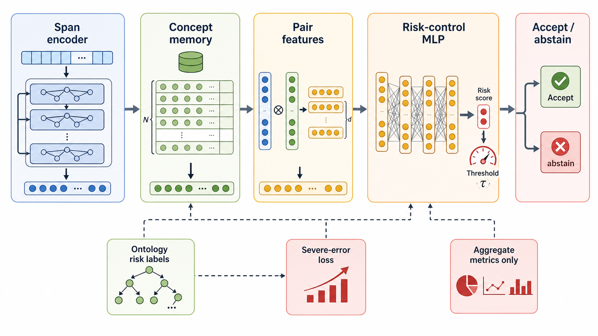
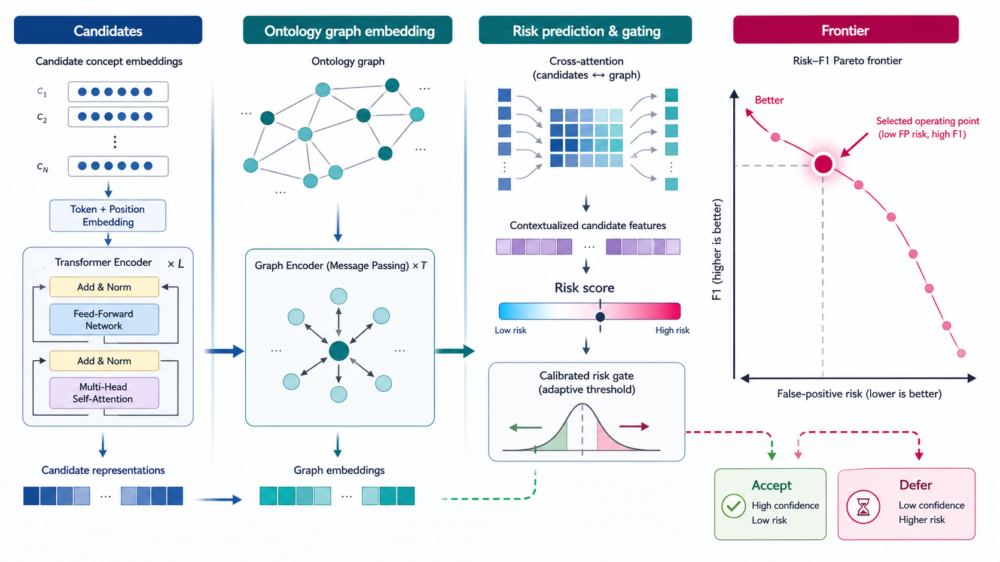

# HOVE Risk-Control Linker

**A research checkpoint and reproducibility package for risk-controlled
clinical concept linking.** HOVE Risk-Control Linker focuses on reducing
severe-error and high-distance false positives while preserving aggregate
linking quality. This repository is structured as a public model-release
artifact, not as a clinical deployment package.



## At a Glance

| Field | Value |
|---|---|
| Release type | Packaged research checkpoint, public config, model card, figures, and aggregate evaluation artifacts |
| Task | Candidate acceptance/deferral for clinical concept linking |
| Primary risk target | Severe-error and high-distance false-positive control |
| Public evidence | Main evaluation table, bootstrap deltas, ablations, figure hashes, and manifest hashes |
| Public data boundary | Aggregate metrics only; no row-level predictions, clinical text, or patient/document identifiers |
| License | MIT for repository code, documentation, tests, release scripts, and public aggregate metadata |

## Purpose

HOVE Risk-Control Linker makes the public, auditable portion of a
clinical concept-linking risk-control model available without exposing
restricted row-level artifacts. The release packages enough information to
inspect the model boundary, verify artifact integrity, compare aggregate
results, and reproduce the public manifest.

The model is scoped to selective risk control: it accepts candidate links
when the risk-control score clears the public threshold and abstains when
the candidate is more likely to create a severe-error or high-distance
false positive. The release is designed for research comparison and
artifact review, not bedside use or production clinical deployment.

Example uses:

- Verify the packaged checkpoint/config hashes and reproduce the public
  aggregate manifest before citing or redistributing the release.
- Compare a new concept-linking risk-control method against the included
  aggregate baselines and bootstrap deltas.
- Inspect the risk frontier to understand the F1 versus high-distance
  false-positive tradeoff at the selected public operating point.
- Use the model card and claim boundary as a template for publishing a
  clinical NLP checkpoint without row-level prediction dumps or clinical
  text.
- Audit a release branch to ensure private paths, internal version labels,
  prediction JSONL files, patient/document identifiers, and concept-memory
  bundles are not committed.

## Repository Layout

| Path | Purpose |
|---|---|
| `release/hove-risk-control-linker/` | Packaged checkpoint, public config, release README, and manifest |
| `docs/public_release/model_card.md` | Model scope, claim boundary, intended use, and exclusions |
| `docs/public_release/performance_tables.md` | Human-readable aggregate evaluation tables |
| `docs/public_release/performance_tables.json` | Machine-readable performance source of truth |
| `docs/public_release/figures/` | Public overview, pipeline, and risk-frontier figures |
| `scripts/make_hove_risk_control_release.py` | Regenerates public metadata and README tables |
| `scripts/audit_public_release.py` | Guards against internal labels, private paths, and row-level artifacts |
| `tests/` | Release-regression and public-audit tests |

The repository intentionally excludes row-level predictions, clinical text,
training/dev/test rows, patient or document identifiers, and the
concept-memory bundle.

## Requirements

The public release checks are tested with Python 3.11. `requirements.txt`
includes the public audit dependencies and the broader HOVE-style runtime
needed to load the packaged checkpoint and build training/inference adapters.

```text
pytest==9.0.3
numpy==2.1.2
pandas==2.3.3
scipy==1.15.3
scikit-learn==1.7.2
torch==2.10.0
transformers==5.5.4
sentence-transformers==5.1.2
```

The included checkpoint is a packaged research artifact. This repository's
public tests verify hashes, manifests, tables, figures, and leak guards;
they do not require private datasets or concept-memory artifacts.

## Quick Start

Clone the repository and install the pinned environment:

```bash
python3 -m venv .venv
. .venv/bin/activate
python -m pip install -U pip
python -m pip install -r requirements.txt
```

Verify the public package before citing, modifying, or redistributing it:

```bash
python3 scripts/audit_public_release.py --allow-doc-local-paths --require-risk-control-release
python3 -m pytest tests/test_public_release_audit.py tests/test_hove_risk_control_release.py -q
python3 -m json.tool docs/public_release/performance_tables.json >/dev/null
python3 -m json.tool release/hove-risk-control-linker/manifest.json >/dev/null
python3 -m json.tool release/hove-risk-control-linker/risk_control_linker_config.json >/dev/null
```

Regenerate the public release metadata after changing source metrics,
figures, or packaged checkpoint artifacts:

```bash
python3 scripts/make_hove_risk_control_release.py \
  --checkpoint release/hove-risk-control-linker/risk_control_linker.pt
```

## Model Package

```text
release/hove-risk-control-linker/risk_control_linker.pt
release/hove-risk-control-linker/risk_control_linker_config.json
release/hove-risk-control-linker/manifest.json
```

The manifest records packaged public artifacts, figure hashes, checkpoint
hashes, and the explicit exclusion of row-level prediction files.

## Evaluation Snapshot

| Model | F1 | Exact | Link Acc | Severity/gold | HDFP/row |
|---|---|---|---|---|---|
| unfiltered top3 | 0.4310 | 0.4840 | 0.9007 | 7.3207 | 1.9527 |
| similarity >=0.85 | 0.5572 | 0.4721 | 0.9123 | 4.3149 | 0.7326 |
| base scalar reference | 0.5720 | 0.4651 | 0.9089 | 4.0368 | 0.6117 |
| risk-aware scalar reference | 0.5760 | 0.4571 | 0.9113 | 3.8948 | 0.5375 |
| HOVE Risk-Control Linker | 0.6660 | 0.4794 | 0.9119 | 2.8358 | 0.1610 |

Lower `Severity/gold` and `HDFP/row` indicate lower severe-error and
high-distance false-positive risk under the public evaluation summary.



## Statistical Comparison

| Comparison | F1 delta | Exact delta | Link Acc delta | Severity delta | HDFP delta | F1 95% CI | Exact 95% CI | Link Acc 95% CI | Severity 95% CI | HDFP 95% CI |
|---|---|---|---|---|---|---|---|---|---|---|
| linker_vs_risk_scalar | 0.0899 | 0.0223 | 0.0006 | -1.0590 | -0.3765 | [0.0891, 0.0906] | [0.0217, 0.0228] | [0.0001, 0.0012] | [-1.0662, -1.0501] | [-0.3786, -0.3740] |
| linker_vs_base_scalar | 0.0940 | 0.0143 | 0.0030 | -1.2010 | -0.4507 | [0.0934, 0.0946] | [0.0138, 0.0147] | [0.0025, 0.0035] | [-1.2085, -1.1921] | [-0.4533, -0.4482] |

Negative severity and HDFP deltas mean the linker reduces those risk metrics
relative to the comparison reference.

## Ablations

| Variant | Threshold | Positive Rate | F1 | Exact | Link Acc | Severity/gold | HDFP/row |
|---|---|---|---|---|---|---|---|
| final true risk-aware near123 | 0.4500 | 0.3487 | 0.6660 | 0.4794 | 0.9119 | 2.8358 | 0.1610 |
| matched true risk-aware near123 | 0.1000 | 0.3493 | 0.6449 | 0.4691 | 0.9137 | 3.0236 | 0.2121 |
| exact-only | 0.0500 | 0.3184 | 0.6091 | 0.4706 | 0.9944 | 3.1339 | 0.2155 |
| randomized risk-aware near123 | 0.0500 | 0.3521 | 0.6458 | 0.4710 | 0.9065 | 3.0639 | 0.2439 |
| degree-depth-random risk-aware near123 | 0.0500 | 0.3498 | 0.6426 | 0.4708 | 0.9140 | 3.0670 | 0.2411 |
| with ontology node features | 0.0500 | -- | 0.6436 | 0.4713 | 0.9133 | 3.0537 | 0.2289 |

## Release Boundary

This repository does not redistribute dataset rows, clinical text, note IDs,
subject IDs, admission IDs, mention offsets, or row-level prediction dumps.
Silver dataset regeneration material is maintained separately as
`clinical-ontology-embeddings/omop-medcat-silver`.

The public package also excludes the concept-memory bundle until its
license boundary is reviewed separately.

## Claim Boundary

This release is limited to severe-error and high-distance false-positive
risk control for clinical concept linking. It does not claim clinical
validation, deployment readiness, or state-of-the-art biomedical entity
linking performance.

## Acknowledgements

This research was supported by the AI Computing Infrastructure Enhancement (GPU Rental Support) User Support Program funded by the Ministry of Science and ICT (MSIT), Republic of Korea (No. RQT-25-120164).

## Citation

If you use this package, cite the corresponding publication and follow the
data usage terms for all upstream clinical and ontology resources.

## License and External Terms

Repository code, documentation, tests, release scripts, and public aggregate
metadata are distributed under the [MIT License](LICENSE). The MIT license
text is also available from the Open Source Initiative:
https://opensource.org/license/mit.

The packaged checkpoint and config are released as public research artifacts
in this repository. They do not include row-level predictions, training
rows, clinical text, patient identifiers, document identifiers, mention
offsets, or the concept-memory bundle.

External resources remain governed by their own terms:

- MIMIC-IV-Note: https://physionet.org/content/mimic-iv-note/
- PhysioNet credentialed access and data-use terms: https://physionet.org/content/mimiciv/view-dua/1.0/
- OMOP Common Data Model: https://www.ohdsi.org/data-standardization/the-common-data-model/
- OHDSI Athena vocabulary access: https://athena.ohdsi.org/
- MedCAT: https://github.com/CogStack/MedCAT
- Recipe-only silver dataset companion: https://github.com/clinical-ontology-embeddings/omop-medcat-silver
